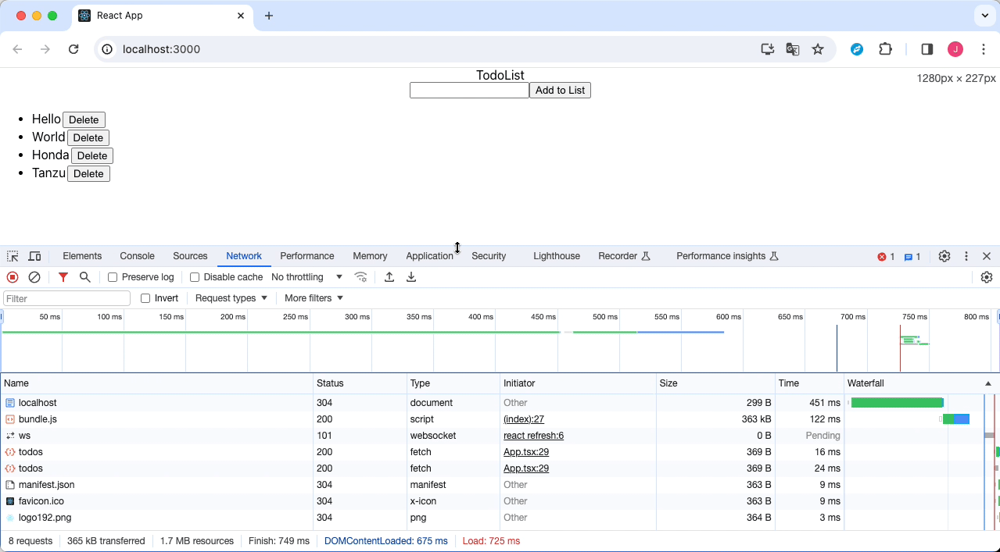

## todo-list

I want to make a rule to keep our project directory clean.

- PLEASE, save files following naming rules.
- frontend
    - frontend application directory
- readme
    - homeworks before we did.
    - file format - {date}-readme.md
- study
    - Stuffs what Yusuke learned.
    - file format - {date}-study-{number}.md

```
./
├── frontend
│         ├── public
│         └── src
├── readme
│         └── images
└── study
```

### 02/03 Study

- Trial using form element when you make an enter event is GOOD. But this is not best practice in React.
    - In react, if you want to make a keyboard event, then use onKeyDown or onKeyUp Event.
    - Study what is the difference between two things.
    - Change form element to div element.
    - Use onKeyDown or onKeyUp event.
- Please check problems are existed or not when typing Japanese after change form to div element.
- Create Backend Application and fetch data from backend.
    - Using Spring Boot Framework (Kotlin) - project name is `backend`.
    - Make TodoController and get data from backend application.
        - API path is /todos.
        - API method is GET.
        - Make a response's format as list of String.
        - Default values from backend is `["Hello", "World", "Honda", "Tanzu"]`.
    - Install axios in frontend and API call to Backend application.
    - You need to understand concept of CORS and proxy.

### After

- When refresh, show data from backend application.



### History

- [01/27 README](readme/2024-01-27-readme)
- [02/03 README](readme/2024-01-30-readme)
