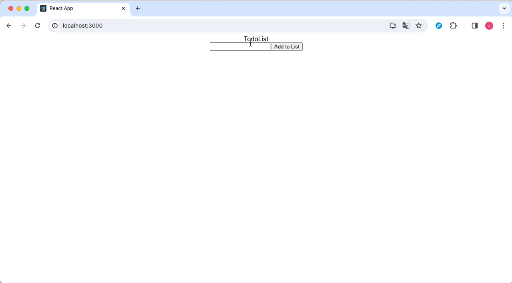

## todo-list

### 01/30 Study

This is next study things. Fix some bugs and enhance our app feature.

1. Remove text in a text box when click the value.
2. Do not add todo when text box value empty.
3. Add todo when typing text and press ENTER key.

### CURRENT

### AFTER

### History

- [01/27 Study](./study/2024-01-27-study.md)

