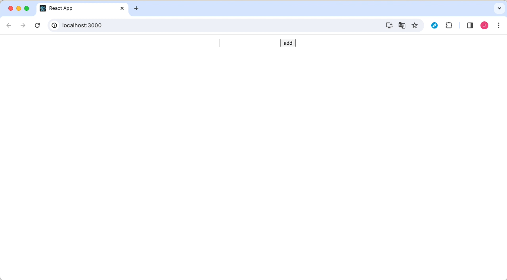

## todo-list

### 01/27 Study

This is study things in weekend. Hint is jun branch. Study these things.

- useState
- onChange Event
- onClick Event

1. create react application
    - vite or CRA(Create React App)
    - CRA is easy!
2. create todo list
    - no test code
    - view input text box and button
    - when click button after typing then add todo

